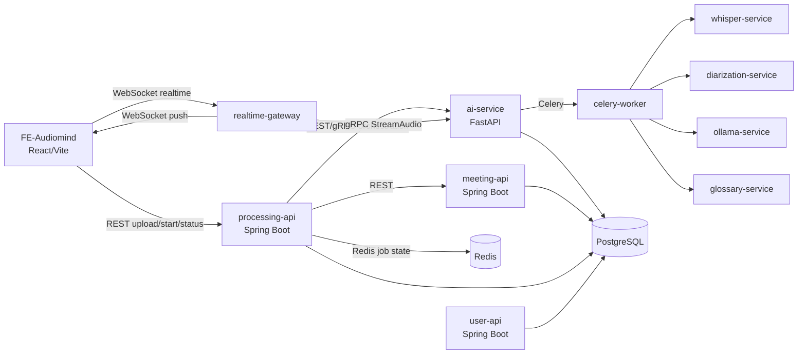

# Architecture Overview

## 1. System Overview

`audiomind-monorepo` is a multi-service platform for meeting ingestion, AI processing, transcript generation, and realtime keyword highlighting.

## 2. Service Summary

- `meeting-service`: manages meeting metadata and upload references.
- `processing-service`: orchestrates processing lifecycle and job state transitions.
- `user-service`: authentication and user account domain.
- `ai-service`: AI orchestration, transcript/analysis APIs, STT adapter integration.
- `whisper-service`: speech recognition support service.
- `diarization-service`: speaker diarization service.
- `ai-processing-service`: additional processing utility service.
- `realtime-gateway`: WebSocket entrypoint and gRPC streaming bridge.
- `glossary-service`: glossary CRUD, versioning, cache/event distribution.
- `redis`: job state/event/cache backbone.
- `postgresql`: primary relational data store.

## 3. Main Processing Flows

### 3.1 Batch/Polling Flow

1. FE uploads audio and starts job via `processing-service`.
2. `processing-service` orchestrates AI processing and updates job state.
3. FE polls status endpoint until completion.
4. FE fetches transcript and analysis payloads.

### 3.2 Realtime Flow (WebSocket + gRPC)

1. FE opens WebSocket session to `realtime-gateway`.
2. Gateway streams audio/events over gRPC (`StreamAudio`) to AI stack.
3. AI stack emits partial transcripts and keyword hits.
4. Gateway pushes realtime events back to FE.
5. Batch fallback remains available behind feature flags.

## 4. Service Communication Patterns

- REST/OpenAPI:
  - bootstrap, upload, processing start/status/results, account flows.
- gRPC/Protobuf:
  - low-latency streaming (`StreamAudio`) and typed event contracts.
- Redis:
  - job-state store, event fan-out/replay support, and async coordination.
- WebSocket:
  - frontend realtime transcript and keyword events.

## 5. Data Stores and Storage

- PostgreSQL:
  - meeting metadata, transcript records, analysis payloads, user data.
- Redis:
  - processing state, transient event/session coordination.
- Object/file storage:
  - audio files and intermediate artifacts (compose volume or cloud storage in non-local environments).

## 6. Quality and Delivery Controls

- CI workflows cover lint, tests, contracts, schema validation, and smoke/security checks.
- Contracts are managed under `packages/contracts` (OpenAPI, JSON schema, proto).
- Frontend and services rely on feature flags for controlled rollout (including realtime enablement).

## 7. Notes for Contributors

- Prefer contract-first changes when touching public APIs.
- Keep service boundaries strict: no cross-database direct access.
- Treat realtime and batch paths as complementary; do not remove fallback behavior without migration planning.
