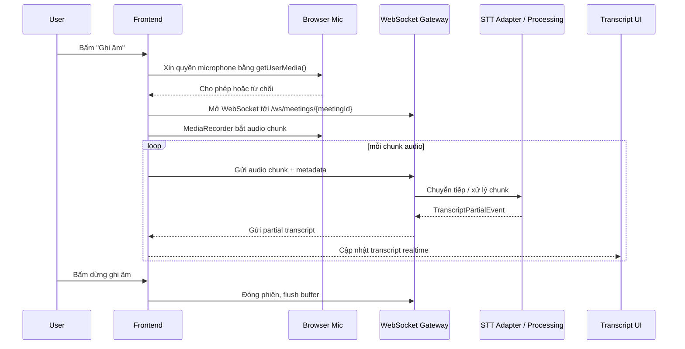

# Plan: UI/UX Improvements for AudioMind

> **Scope:** Tối ưu luồng nhập liệu hiện tại và thiết kế nền tảng cho ghi âm trực tiếp
>
> **Status:** Draft
>
> **Mục tiêu:** Giảm ma sát UX ở luồng Meeting/User, đồng thời mở đường cho tính năng ghi âm trực tiếp và transcript realtime mà không phá vỡ luồng upload file hiện có.

---

## 1. Tóm Tắt Phân Tích Hiện Trạng

### 1.1. Form nhập liệu thủ công đang nằm ngay trong `App.tsx`

Hiện tại, màn hình chính của frontend vẫn giữ state `realtimeMeetingId`, `realtimeUserId` và một nhánh UI “Realtime Mode (Beta)” có input nhập tay Meeting ID và User ID. Điều này làm luồng realtime phụ thuộc vào dữ liệu mà người dùng không nên phải biết trước.

Tại cùng file, luồng batch upload vẫn là luồng chính: upload file, gọi `startProcessingByPath()`, polling `getProcessingStatus()`, rồi lấy `getTranscript()` và `getAnalysis()`.

### 1.2. Token hiện được lưu trong localStorage, nhưng chưa có lớp diễn giải JWT rõ ràng

`auth.ts` hiện chỉ lưu `accessToken` và expiry vào localStorage. Có `getAccessToken()`, `setAccessToken()`, `clearAccessToken()`, nhưng chưa có utility riêng để decode JWT payload.

Điểm quan trọng: backend auth response đã trả về `userId`, nên frontend có thể dùng `userId` từ response làm nguồn dữ liệu ưu tiên, còn JWT decode chỉ nên là lớp hỗ trợ/fallback.

### 1.3. API hiện có đủ mảnh ghép, nhưng luồng chưa được tổ chức lại

`api.ts` đã có các hàm liên quan đến meeting và processing như `createMeeting()`, `getMeeting()`, `processMeeting()`, `uploadToMeetingApi()`, `startProcessingByPath()`, `getTranscript()`, `getAnalysis()`, và `getProcessingStatus()`.

Điều này cho thấy vấn đề hiện tại không nằm ở thiếu endpoint, mà chủ yếu là frontend chưa chọn đúng orchestration strategy và còn trộn giữa UI state với hạ tầng dữ liệu.

### 1.4. Realtime contract và backend handshake đã có nền tảng

`realtime-events.proto` đã định nghĩa `AudioChunk`, `TranscriptPartialEvent`, `KeywordHitEvent`, và `StreamEnvelope`.

Ở backend, `WebSocketJwtHandshakeInterceptor` đã cho phép xác thực bằng `Authorization` header hoặc `token` query parameter, đồng thời lấy `meetingId` từ path `/ws/meetings/{meetingId}`.

Kết luận: nền tảng realtime đã có, nhưng frontend cần một kiến trúc sạch hơn để đưa audio từ microphone lên WebSocket và render transcript từng phần.

### 1.5. Cấu hình WebSocket chưa được chuẩn hóa ở frontend

`config.ts` hiện chỉ quản lý API base URL và cờ `REALTIME_WS_ENABLED`. Base URL WebSocket chưa được chuẩn hóa ở đây.

Ngoài ra, hook hiện có `useRealtimeMeetingStream.ts` vẫn đang dùng một fallback kiểu legacy và tự gắn token vào URL. Đây là dấu hiệu của một prototype hữu ích, nhưng chưa phải lớp kiến trúc cuối cùng.

---

## 2. Phần 1: Tự Động Hóa Form Nhập Liệu (Meeting ID & User ID)

### 2.1. Phân tích hiện trạng

- `App.tsx` đang dùng state local để điều khiển Meeting ID/User ID thủ công.
- `auth.ts` lưu token nhưng chưa có lớp decode JWT hoặc chuẩn hóa “auth session” cho frontend.
- `api.ts` đã có đủ các hàm meeting/processing, nên phần thiếu nằm ở orchestration và UX.

### 2.2. Ba phương án giải quyết

| Phương án | Mô tả ý tưởng | Ưu điểm | Nhược điểm | Độ phức tạp |
|---|---|---|---|---|
| A: Tối giản | Tự động điền User ID từ JWT và tạo Meeting ID mới ngay khi trang load. Ẩn hoàn toàn form nhập. | Nhanh nhất, UX mượt. | Dễ sinh meeting “rác”, khó xem lại lịch sử. | Thấp |
| B: Cân bằng | Tự động hóa 90%: tạo meeting mới khi người dùng bắt đầu upload hoặc ghi âm. Chỉ mở form nâng cao khi bấm “Tham gia Meeting khác”. | Ít ma sát, vẫn còn đường lui cho người dùng nâng cao. | Cần thêm một lớp UI nhỏ và logic xác định “intent” của người dùng. | Trung bình |
| C: Hoàn chỉnh | Trang chủ có “Tạo Meeting mới” và “Meeting gần đây”. Nhập ID thủ công chỉ còn là tùy chọn tìm kiếm nâng cao. | Chuyên nghiệp nhất, có chiều sâu sản phẩm. | Đòi hỏi nhiều thay đổi UI/UX và data model hơn. | Cao |

### 2.3. Khuyến nghị

Khuyến nghị chọn **Phương án B** cho giai đoạn đầu.

Lý do:
- Không ép người dùng nhập thứ họ không cần biết.
- Không tạo meeting vô tội vạ ngay khi page load.
- Giữ được một đường “nâng cao” cho người dùng muốn join meeting cũ hoặc debug.
- Phù hợp nhất với roadmap có cả batch upload lẫn live recording.

### 2.4. Trả lời các câu hỏi phân tích chuyên sâu

**Cơ chế trích xuất `user_id` từ JWT payload**

- Có thể thêm `parseJwt` utility để decode payload ở client, nhưng chỉ dùng cho mục đích hiển thị và khởi tạo state.
- Không dùng JWT decode như nguồn xác thực duy nhất, vì token decode ở client chỉ là dữ liệu tham khảo.
- Nguồn ưu tiên nên là `userId` trả về từ login response hoặc một auth session object được lưu cùng token.

**Thời điểm thích hợp để tạo meeting mới**

- Không nên tạo ngay khi trang load, vì sẽ sinh meeting rỗng nếu người dùng rời đi.
- Nên tạo khi người dùng có hành động có ý định rõ ràng: bấm “Phân tích file”, “Bắt đầu ghi âm”, hoặc “Tạo Meeting mới”.
- Nếu muốn tối ưu UX hơn nữa, có thể tạo meeting ngay sau khi người dùng chọn file hoặc sau khi permission microphone được cấp, nhưng vẫn phải gắn với hành động rõ ràng.

**Cách xử lý meeting cũ**

- Có thể lưu một danh sách “recent meetings” vào localStorage như cache UX, tối đa khoảng 10-20 mục gần nhất.
- localStorage chỉ nên là tiện ích hiển thị, không phải nguồn dữ liệu chuẩn.
- Về lâu dài, nên lấy lịch sử từ backend để tránh mất dữ liệu khi người dùng đổi trình duyệt hoặc xóa storage.

### 2.5. Quyết định UX được đề xuất

- Mặc định mở màn hình không có form ID thủ công.
- Hiển thị một CTA chính: “Tạo Meeting mới / Upload / Ghi âm”.
- Chỉ lộ form Meeting ID ở chế độ nâng cao hoặc “Tham gia meeting khác”.
- `userId` nên được suy ra từ phiên đăng nhập thay vì yêu cầu nhập tay.

---

## 3. Phần 2: Tính Năng Ghi Âm Trực Tiếp (Live Recording)

### 3.1. Kiến trúc tổng thể đề xuất

### 3.2. Phân tích thách thức kỹ thuật

| Thách thức | Mô tả chi tiết | Giải pháp đề xuất |
|---|---|---|
| Quyền Microphone | Trình duyệt chỉ cấp microphone trên HTTPS hoặc localhost, và có thể bị từ chối bởi user. | Dùng `navigator.mediaDevices.getUserMedia()` với error handling rõ ràng, mapping từng lỗi sang thông điệp UX dễ hiểu. |
| Định dạng Audio | MediaRecorder thường xuất ra WebM/Opus, trong khi backend có thể cần PCM/WAV. | Ưu tiên Opus/WebM cho MVP vì nhẹ và dễ thu. Nếu backend cần PCM, chuyển mã ở server/gateway; PCM chỉ nên dùng khi cần kiểm soát chất lượng/latency rất chặt. |
| Xác thực WebSocket | JWT phải được đưa vào handshake hoặc bước auth đầu tiên. | Dùng `Authorization` header nếu môi trường cho phép. Fallback bằng `token` query param chỉ cho dev. Nếu cần an toàn hơn nữa, có thể dùng message `auth.init` đầu tiên, nhưng vẫn nên coi handshake auth là lớp chính. |
| Ngắt kết nối | Mạng có thể chập chờn, WebSocket có thể đóng bất ngờ. | Auto-reconnect với exponential backoff, giữ buffer audio chunk chưa gửi và chỉ flush lại khi socket mở ổn định. |
| Hiệu năng UI | Transcript có thể tăng nhanh thành hàng trăm dòng, gây lag render. | Dùng virtual scrolling như `react-virtuoso`, và gom cập nhật theo nhịp animation frame nếu cần. |
| Đồng bộ trạng thái | Trạng thái ghi âm, kết nối, reconnect, lỗi mic dễ lệch nhau. | Quản lý bằng state machine trong `useReducer` hoặc custom hook chuyên trách để tránh state chồng chéo. |

### 3.3. Thành phần frontend cần phát triển

**`useAudioRecorder` hook**

- Quản lý toàn bộ vòng đời phiên ghi âm.
- Xin quyền microphone, khởi tạo MediaRecorder, tạo chunk audio, xử lý pause/resume/stop.
- Phát trạng thái rõ ràng cho UI: idle, requesting-permission, recording, paused, error.

**`AudioRecorderButton` component**

- Là nút điều khiển chính cho bắt đầu/dừng ghi âm.
- Hiển thị đèn trạng thái, thời lượng ghi âm, và trạng thái lỗi quyền microphone nếu có.

**`useRealtimeConnection` hook**

- Quản lý WebSocket connection lifecycle.
- Chịu trách nhiệm connect, reconnect, gửi chunk audio, nhận partial transcript, và chuyển đổi message sang state UI.

**`RealtimeTranscriptView` component**

- Hiển thị transcript cuộn theo thời gian thực.
- Hỗ trợ cập nhật incremental, highlight segment mới, và tối ưu render cho danh sách dài.

### 3.4. So sánh với luồng upload file

| Tiêu chí | Upload File (Hiện tại) | Ghi âm Trực tiếp (Tương lai) | Cơ hội dùng chung code? |
|---|---|---|---|
| Input | File MP3 tĩnh | Stream audio từ microphone | Không |
| Transport | HTTP POST | WebSocket | Không |
| Kết quả | Transcript cuối cùng | Transcript từng phần | Có: component hiển thị transcript và phân tích có thể dùng chung |
| Feedback UX | Trạng thái “Đang xử lý...” | Transcript xuất hiện dần trong khi nói | Có: `StatusToast` và `FeatureAnalysis` có thể tái sử dụng |
| Quản lý meeting | Chọn ID thủ công / orchestration hiện tại | Tạo meeting gắn với phiên ghi âm | Có: logic tạo meeting và auth session có thể chia sẻ |

### 3.5. Nhận xét kiến trúc

- Luồng upload file và live recording nên cùng tồn tại, không nên thay thế nhau ngay.
- Upload file vẫn hữu ích cho dữ liệu có sẵn, còn live recording là luồng “core product” của họp.
- Nên tách rõ lớp input audio, transport, và render transcript để dùng chung càng nhiều càng tốt.

---

## 4. Phần 3: Lộ Trình Triển Khai (Roadmap)

### Giai đoạn 1: Nâng cấp UX form nhập liệu, 2-3 giờ

**Mục tiêu:** Triển khai phương án B, tự động hóa phần lớn Meeting/User, ẩn form nâng cao.

**Kết quả mong đợi:**
- Người dùng upload file hoặc vào luồng realtime mà không cần nhập Meeting ID/User ID thủ công.
- `userId` được lấy từ auth session, `meetingId` được tạo theo ngữ cảnh hành động.
- Form thủ công chỉ còn ở chế độ nâng cao.

### Giai đoạn 2: Xây dựng MVP ghi âm trực tiếp, 5-7 giờ

**Mục tiêu:** Tạo `useAudioRecorder` và `AudioRecorderButton`, mở kết nối WebSocket cơ bản, gửi chunk audio.

**Kết quả mong đợi:**
- Người dùng có thể bấm ghi âm và audio được stream lên server.
- Transcript realtime có thể chưa hoàn chỉnh, nhưng pipeline âm thanh hoạt động end-to-end.

### Giai đoạn 3: Tích hợp realtime transcript, 4-6 giờ

**Mục tiêu:** Phát triển `RealtimeTranscriptView`, nhận `TranscriptPartialEvent` và hiển thị live.

**Kết quả mong đợi:**
- Transcript xuất hiện theo thời gian thực trong lúc người dùng nói.
- Có thể mở rộng thêm keyword hit và event phụ nếu backend đã phát.

### Giai đoạn 4: Hoàn thiện và tối ưu, 3-4 giờ

**Mục tiêu:** Xử lý edge case, tối ưu UI, thêm animation và responsive.

**Kết quả mong đợi:**
- Có reconnect, timeout, xử lý từ chối quyền microphone, đổi thiết bị âm thanh.
- UI ổn định khi transcript dài.
- Sẵn sàng demo cho người dùng cuối.

---

## 5. Phần 4: Các Quyết Định Cần Đưa Ra

### 5.1. Quyết định ưu tiên

1. Nên sửa UX form nhập liệu trước hay phát triển luôn ghi âm trực tiếp? 
2. Có làm song song được không, hay cần khóa chặt thứ tự triển khai?

### 5.2. Quyết định chiến lược

3. Chọn phương án nào cho tự động hóa Meeting/User: A, B hay C?
4. Live recording có thay thế hoàn toàn upload file hay cả hai sẽ cùng tồn tại?

### 5.3. Quyết định kỹ thuật

5. Ưu tiên audio format nào cho MVP: Opus/WebM hay PCM/WAV?
6. WebSocket có phải được xác thực token ngay từ đầu hay chấp nhận nới lỏng ở giai đoạn phát triển?
7. Có cần lưu meeting gần đây trong localStorage như cache UX không, hay chờ backend history trước?

### 5.4. Khuyến nghị mặc định để chốt roadmap

- **Ưu tiên:** Làm UX form trước, sau đó mới làm live recording. Hai mảng có thể chia sẻ một số helper, nhưng không nên song song ngay từ đầu vì sẽ phân tán nỗ lực.
- **Tự động hóa:** Chọn **B**.
- **Audio format:** Chọn **Opus/WebM** cho MVP, chuyển mã server-side nếu backend cần PCM.
- **Bảo mật WebSocket:** Không bỏ qua token auth; giữ auth ngay từ đầu, fallback query param chỉ cho dev/local.
- **Phạm vi tính năng:** Giữ cả upload file và ghi âm trực tiếp cùng tồn tại.

---

## 6. Kết Luận

Hiện trạng của AudioMind cho thấy vấn đề không nằm ở thiếu endpoint, mà nằm ở việc UX đang phơi bày quá nhiều chi tiết kỹ thuật cho người dùng cuối. Bước đi đúng là giảm ma sát ở form nhập liệu trước, chuẩn hóa auth/session ở frontend, rồi xây dựng live recording trên nền tảng contract và handshake đã có sẵn.

Nếu đi theo roadmap này, hệ thống sẽ giữ được luồng upload hiện tại, đồng thời mở rộng thành một trải nghiệm họp tự nhiên hơn: bấm tạo meeting, bấm ghi âm, xem transcript xuất hiện theo thời gian thực.